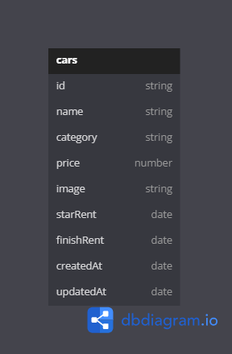

# Binar Car Rental

## Guide to Run 
* `npm i` to install all the dependencies
* Don't forget to make your own `.env` based on `example.env`
* When its finish:
    * `npm run build` to compile all these typescript things
    * `npm run dev` to run the server ⚡

## About Migrations and Seeds
* `knex migrate:latest` to run the migration's file
* `knex seed:run` to fill data on database

## Entity Relationship Diagram

For now only one table is available: <br>
https://dbdiagram.io/d/challenge_5-664307bc9e85a46d55c75833 <br> <br>
 <br>

## API ENDPOINT LIST

| API ENDPOINT              | METHOD   |     DESCRIPTION        |
|---------------------------|----------|------------------------|
| `api/v1/cms/api/cars`     |   `GET`  | Get All Data Cars      |
| `api/v1/cms/api/cars/:id` |   `GET`  | Get By Id Data Cars    |
| `api/v1/cms/api/cars/`    |  `POST`  | Post Data Cars         |
| `api/v1/cms/api/cars/:id` |   `PUT`  | Update Data Cars By Id |
| `api/v1/cms/api/cars/:id` | `DELETE` | Delete Data Cars By Id |

## REST API Endpoints
-----------------------
### Get All Cars

- **Show All Data Cars**
    - **Request** 
        - Endpoint : `/api/v1/cms/cars`
        - method : `GET`
    - **Get Data Success**
        - Request :
          ```
          curl -i --location 'http://localhost:9000/api/cars'
          ```
        - Response :
          ```
          HTTP/1.1 200 OK
          X-Powered-By: Express
          Content-Type: application/json; charset=utf-8
          Content-Length: 1578
          ETag: W/"62a-gLb8gOcDaSFgSle5SRl90LssCM8"
          Date: Fri, 17 May 2024 12:32:10 GMT
          Connection: keep-alive
          Keep-Alive: timeout=5

          {
             "status": 200,
             "message": "Get all car data successfully",
             "data": {
                 "cars": [
                     {
                         "id": "3d71f905-cd6d-447c-86e6-c5cb19159a45",
                         "name": "Nissan Altima",
                         "category": "Medium",
                         "price": 10000,
                         "image": "https://res.cloudinary.com/dmuuypm2t/image/upload/v1710400118/img_car_lhk3me.png",
                         "startRent": null,
                         "finishRent": null,
                         "createdAt": "2024-05-18T13:32:02.567Z",
                         "updatedAt": "2024-05-18T13:32:02.567Z"
                     },
                     {
                         "id": "fb4b1e5c-4add-470d-9a2c-d1bdcce4fb38",
                         "name": "Chevrolet Camaro",
                         "category": "Small",
                         "price": 100.05,
                         "image": "https://res.cloudinary.com/dmuuypm2t/image/upload/v1710400118/img_car_lhk3me.png",
                         "startRent": null,
                         "finishRent": null,
                         "createdAt": "2024-05-18T13:32:02.567Z",
                         "updatedAt": "2024-05-18T13:32:02.567Z"
                     },
                     {
                         "id": "06b34192-0936-4b96-a859-85f20d2b08c5",
                         "name": "Volkswagen Golf",
                         "category": "large",
                         "price": 20000,
                         "image": "https://res.cloudinary.com/dmuuypm2t/image/upload/v1710400118/img_car_lhk3me.png",
                         "startRent": null,
                         "finishRent": null,
                         "createdAt": "2024-05-18T13:32:02.567Z",
                         "updatedAt": "2024-05-18T13:32:02.567Z"
                     },
                     {
                         "id": "8d2035fe-abe0-46eb-9b7a-40369e9132ce",
                         "name": "Tesla Model S",
                         "category": "Small",
                         "price": 30000,
                         "image": "https://res.cloudinary.com/dmuuypm2t/image/upload/v1710400118/img_car_lhk3me.png",
                         "startRent": null,
                         "finishRent": null,
                         "createdAt": "2024-05-18T13:32:02.567Z",
                         "updatedAt": "2024-05-18T13:32:02.567Z"
                     },
                     {
                         "id": "ba2204d7-0728-4131-85a6-cf88ead91074",
                         "name": "BMW X5",
                         "category": "large",
                         "price": 400.05,
                         "image": "https://res.cloudinary.com/dmuuypm2t/image/upload/v1710400118/img_car_lhk3me.png",
                         "startRent": null,
                         "finishRent": null,
                         "createdAt": "2024-05-18T13:32:02.567Z",
                         "updatedAt": "2024-05-18T13:32:02.567Z"
                     },
                     {
                         "id": "a72a6697-ade3-442a-9f49-3debe9d5aaa1",
                         "name": "Audi Q7",
                         "category": "small",
                         "price": 50.05,
                         "image": "https://res.cloudinary.com/dmuuypm2t/image/upload/v1710400118/img_car_lhk3me.png",
                         "startRent": null,
                         "finishRent": null,
                         "createdAt": "2024-05-18T13:32:02.568Z",
                         "updatedAt": "2024-05-18T13:32:02.568Z"
                     },
                     {
                         "id": "76115319-b08b-48c5-858f-7a6c3d454f98",
                         "name": "Mercedes-Benz C-Class",
                         "category": "large",
                         "price": 500000,
                         "image": "https://res.cloudinary.com/dmuuypm2t/image/upload/v1710400118/img_car_lhk3me.png",
                         "startRent": null,
                         "finishRent": null,
                         "createdAt": "2024-05-18T13:32:02.568Z",
                         "updatedAt": "2024-05-18T13:32:02.568Z"
                     },
                     {
                         "id": "dcef4300-21f7-4fcf-afe3-30cbc174e25f",
                         "name": "Toyota RAV4",
                         "category": "medium",
                         "price": 30000,
                         "image": "https://res.cloudinary.com/dmuuypm2t/image/upload/v1710400118/img_car_lhk3me.png",
                         "startRent": null,
                         "finishRent": null,
                         "createdAt": "2024-05-18T13:32:02.568Z",
                         "updatedAt": "2024-05-18T13:32:02.568Z"
                     },
                     {
                         "id": "ffeb9e55-22a8-46c8-856b-75061b23b67c",
                         "name": "Ford F-150",
                         "category": "small",
                         "price": 30000,
                         "image": "https://res.cloudinary.com/dmuuypm2t/image/upload/v1710400118/img_car_lhk3me.png",
                         "startRent": null,
                         "finishRent": null,
                         "createdAt": "2024-05-18T13:32:02.568Z",
                         "updatedAt": "2024-05-18T13:32:02.568Z"
                     },
                     {
                         "id": "5ccdb6ec-6d09-410f-9618-0b301e80a875",
                         "name": "Honda Accord",
                         "category": "small",
                         "price": 40000,
                         "image": "https://res.cloudinary.com/dmuuypm2t/image/upload/v1710400118/img_car_lhk3me.png",
                         "startRent": null,
                         "finishRent": null,
                         "createdAt": "2024-05-18T13:32:02.568Z",
                         "updatedAt": "2024-05-18T13:32:02.568Z"
                     },
                     {
                         "id": "9eb35667-f923-4940-a4cf-3cd8db99b00e",
                         "name": "ferrari",
                         "category": "large",
                         "price": 4000000,
                         "image": "https://res.cloudinary.com/dmuuypm2t/image/upload/v1710400118/img_car_lhk3me.png",
                         "startRent": null,
                         "finishRent": null,
                         "createdAt": "2024-05-18T13:32:02.568Z",
                         "updatedAt": "2024-05-18T13:32:02.568Z"
                     }
                 ]
             }
          }
          ```

   - **Show All Data Cars By Name**
    - **Request** 
        - Endpoint : `/api/v1/cms/cars`
        - Params : `name`
        - method : `GET`
    - **Get Data Success**
        - Request :
          ```
          curl -i --location 'http://localhost:9000/api/cars?name=Ferrari'
          --form 'name="Ferrari"' \
          ```
        - Response :
          ```
          HTTP/1.1 200 OK
          X-Powered-By: Express
          Content-Type: application/json; charset=utf-8
          Content-Length: 1578
          ETag: W/"62a-gLb8gOcDaSFgSle5SRl90LssCM8"
          Date: Fri, 17 May 2024 12:32:10 GMT
          Connection: keep-alive
          Keep-Alive: timeout=5

            {
                "status": 200,
                "message": "Get all car data successfully",
                "data": {
                    "cars": [
                        {
                            "id": "9eb35667-f923-4940-a4cf-3cd8db99b00e",
                            "name": "ferrari",
                            "category": "large",
                            "price": 4000000,
                            "image": "https://res.cloudinary.com/dmuuypm2t/image/upload/v1710400118/img_car_lhk3me.png",
                            "startRent": null,
                            "finishRent": null,
                            "createdAt": "2024-05-18T13:32:02.568Z",
                            "updatedAt": "2024-05-18T13:32:02.568Z"
                        }
                    ],
                    "totalPages": 1
                }
            }
          ```

  - **Show All Data Cars By Category**
    - **Request** 
        - Endpoint : `/api/v1/cms/cars`
        - Params : `category`
        - method : `GET`
    - **Get Data Success**
        - Request :
          ```
          curl -i --location 'http://localhost:9000/api/cars?category=large'
          --form 'category="large"' \
          ```
        - Response :
          ```
          HTTP/1.1 200 OK
          X-Powered-By: Express
          Content-Type: application/json; charset=utf-8
          Content-Length: 1578
          ETag: W/"62a-gLb8gOcDaSFgSle5SRl90LssCM8"
          Date: Fri, 17 May 2024 12:32:10 GMT
          Connection: keep-alive
          Keep-Alive: timeout=5

            {
             "status": 200,
             "message": "Get all car data successfully",
             "data": {
                 "cars": [
                     {
                         "id": "06b34192-0936-4b96-a859-85f20d2b08c5",
                         "name": "Volkswagen Golf",
                         "category": "large",
                         "price": 20000,
                         "image": "https://res.cloudinary.com/dmuuypm2t/image/upload/v1710400118/img_car_lhk3me.png",
                         "startRent": null,
                         "finishRent": null,
                         "createdAt": "2024-05-18T13:32:02.567Z",
                         "updatedAt": "2024-05-18T13:32:02.567Z"
                     },
                     {
                         "id": "ba2204d7-0728-4131-85a6-cf88ead91074",
                         "name": "BMW X5",
                         "category": "large",
                         "price": 400.05,
                         "image": "https://res.cloudinary.com/dmuuypm2t/image/upload/v1710400118/img_car_lhk3me.png",
                         "startRent": null,
                         "finishRent": null,
                         "createdAt": "2024-05-18T13:32:02.567Z",
                         "updatedAt": "2024-05-18T13:32:02.567Z"
                     },
                     {
                         "id": "76115319-b08b-48c5-858f-7a6c3d454f98",
                         "name": "Mercedes-Benz C-Class",
                         "category": "large",
                         "price": 500000,
                         "image": "https://res.cloudinary.com/dmuuypm2t/image/upload/v1710400118/img_car_lhk3me.png",
                         "startRent": null,
                         "finishRent": null,
                         "createdAt": "2024-05-18T13:32:02.568Z",
                         "updatedAt": "2024-05-18T13:32:02.568Z"
                     },
                     {
                         "id": "9eb35667-f923-4940-a4cf-3cd8db99b00e",
                         "name": "ferrari",
                         "category": "large",
                         "price": 4000000,
                         "image": "https://res.cloudinary.com/dmuuypm2t/image/upload/v1710400118/img_car_lhk3me.png",
                         "startRent": null,
                         "finishRent": null,
                         "createdAt": "2024-05-18T13:32:02.568Z",
                         "updatedAt": "2024-05-18T13:32:02.568Z"
                     }
                 ],
                 "totalPages": 1
             }
          }
          ```

   - **Show All Data Cars With Pagination**
    - **Request** 
        - Endpoint : `/api/v1/cms/cars`
        - Params : `page`
                 : `pageSize`
        - method : `GET`
    - **Get Data Success**
        - Request :
          ```
          curl -i --location 'http://localhost:9000/api/cars?page=1&pageSize=10'
          --form 'page=1' \
          --form 'pageSize=10' \
          ```
        - Response :
          ```
          HTTP/1.1 200 OK
          X-Powered-By: Express
          Content-Type: application/json; charset=utf-8
          Content-Length: 1578
          ETag: W/"62a-gLb8gOcDaSFgSle5SRl90LssCM8"
          Date: Fri, 17 May 2024 12:32:10 GMT
          Connection: keep-alive
          Keep-Alive: timeout=5

            {
             "status": 200,
             "message": "Get all car data successfully",
             "data": {
                 "cars": [
                     {
                         "id": "3d71f905-cd6d-447c-86e6-c5cb19159a45",
                         "name": "Nissan Altima",
                         "category": "Medium",
                         "price": 10000,
                         "image": "https://res.cloudinary.com/dmuuypm2t/image/upload/v1710400118/img_car_lhk3me.png",
                         "startRent": null,
                         "finishRent": null,
                         "createdAt": "2024-05-18T13:32:02.567Z",
                         "updatedAt": "2024-05-18T13:32:02.567Z"
                     },
                     {
                         "id": "fb4b1e5c-4add-470d-9a2c-d1bdcce4fb38",
                         "name": "Chevrolet Camaro",
                         "category": "Small",
                         "price": 100.05,
                         "image": "https://res.cloudinary.com/dmuuypm2t/image/upload/v1710400118/img_car_lhk3me.png",
                         "startRent": null,
                         "finishRent": null,
                         "createdAt": "2024-05-18T13:32:02.567Z",
                         "updatedAt": "2024-05-18T13:32:02.567Z"
                     },
                     {
                         "id": "06b34192-0936-4b96-a859-85f20d2b08c5",
                         "name": "Volkswagen Golf",
                         "category": "large",
                         "price": 20000,
                         "image": "https://res.cloudinary.com/dmuuypm2t/image/upload/v1710400118/img_car_lhk3me.png",
                         "startRent": null,
                         "finishRent": null,
                         "createdAt": "2024-05-18T13:32:02.567Z",
                         "updatedAt": "2024-05-18T13:32:02.567Z"
                     },
                     {
                         "id": "8d2035fe-abe0-46eb-9b7a-40369e9132ce",
                         "name": "Tesla Model S",
                         "category": "Small",
                         "price": 30000,
                         "image": "https://res.cloudinary.com/dmuuypm2t/image/upload/v1710400118/img_car_lhk3me.png",
                         "startRent": null,
                         "finishRent": null,
                         "createdAt": "2024-05-18T13:32:02.567Z",
                         "updatedAt": "2024-05-18T13:32:02.567Z"
                     },
                     {
                         "id": "ba2204d7-0728-4131-85a6-cf88ead91074",
                         "name": "BMW X5",
                         "category": "large",
                         "price": 400.05,
                         "image": "https://res.cloudinary.com/dmuuypm2t/image/upload/v1710400118/img_car_lhk3me.png",
                         "startRent": null,
                         "finishRent": null,
                         "createdAt": "2024-05-18T13:32:02.567Z",
                         "updatedAt": "2024-05-18T13:32:02.567Z"
                     },
                     {
                         "id": "a72a6697-ade3-442a-9f49-3debe9d5aaa1",
                         "name": "Audi Q7",
                         "category": "small",
                         "price": 50.05,
                         "image": "https://res.cloudinary.com/dmuuypm2t/image/upload/v1710400118/img_car_lhk3me.png",
                         "startRent": null,
                         "finishRent": null,
                         "createdAt": "2024-05-18T13:32:02.568Z",
                         "updatedAt": "2024-05-18T13:32:02.568Z"
                     },
                     {
                         "id": "76115319-b08b-48c5-858f-7a6c3d454f98",
                         "name": "Mercedes-Benz C-Class",
                         "category": "large",
                         "price": 500000,
                         "image": "https://res.cloudinary.com/dmuuypm2t/image/upload/v1710400118/img_car_lhk3me.png",
                         "startRent": null,
                         "finishRent": null,
                         "createdAt": "2024-05-18T13:32:02.568Z",
                         "updatedAt": "2024-05-18T13:32:02.568Z"
                     },
                     {
                         "id": "dcef4300-21f7-4fcf-afe3-30cbc174e25f",
                         "name": "Toyota RAV4",
                         "category": "medium",
                         "price": 30000,
                         "image": "https://res.cloudinary.com/dmuuypm2t/image/upload/v1710400118/img_car_lhk3me.png",
                         "startRent": null,
                         "finishRent": null,
                         "createdAt": "2024-05-18T13:32:02.568Z",
                         "updatedAt": "2024-05-18T13:32:02.568Z"
                     },
                     {
                         "id": "ffeb9e55-22a8-46c8-856b-75061b23b67c",
                         "name": "Ford F-150",
                         "category": "small",
                         "price": 30000,
                         "image": "https://res.cloudinary.com/dmuuypm2t/image/upload/v1710400118/img_car_lhk3me.png",
                         "startRent": null,
                         "finishRent": null,
                         "createdAt": "2024-05-18T13:32:02.568Z",
                         "updatedAt": "2024-05-18T13:32:02.568Z"
                     },
                     {
                         "id": "5ccdb6ec-6d09-410f-9618-0b301e80a875",
                         "name": "Honda Accord",
                         "category": "small",
                         "price": 40000,
                         "image": "https://res.cloudinary.com/dmuuypm2t/image/upload/v1710400118/img_car_lhk3me.png",
                         "startRent": null,
                         "finishRent": null,
                         "createdAt": "2024-05-18T13:32:02.568Z",
                         "updatedAt": "2024-05-18T13:32:02.568Z"
                     }
                 ],
                 "totalPages": 2
             }
          }
          ```
-----------------------
### Get Car by ID

- **Show Data Cars By Id**
    - **Request** 
        - Endpoint : `api/v1/cms/api/cars/:id`
        - method : `GET`
    - **Get Data Success**
        - Request :
          ```
          curl -i --location 'http://localhost:9000/api/v1/cms/cars/ffeb9e55-22a8-46c8-856b-75061b23b67c'
          ```
        - Response :
          ```
          HTTP/1.1 200 OK
          X-Powered-By: Express
          Content-Type: application/json; charset=utf-8
          Content-Length: 376
          ETag: W/"178-b6opYxiDk80e5+AAGPg4qX9nJLA"
          Date: Fri, 17 May 2024 12:36:11 GMT
          Connection: keep-alive
          Keep-Alive: timeout=5
            
            {
                "status": 200,
                "message": "Get car data by ID successfully",
                "data": {
                    "id": "ffeb9e55-22a8-46c8-856b-75061b23b67c",
                    "name": "Ford F-150",
                    "category": "small",
                    "price": 30000,
                    "image": "https://res.cloudinary.com/dmuuypm2t/image/upload/v1710400118/img_car_lhk3me.png",
                    "startRent": null,
                    "finishRent": null,
                    "createdAt": "2024-05-18T13:32:02.568Z",
                    "updatedAt": "2024-05-18T13:32:02.568Z"
                }
            }
          ```
    - **Get Data Not Found**
        - Request :
          ```
          curl -i --location 'http://localhost:9000/api/v1/cms/cars/ffeb9e55-22a8-46c8-856b-75061b23b67c'
          ```
        - Response :
          ```
          HTTP/1.1 404 Not Found
          X-Powered-By: Express
          Content-Type: application/json; charset=utf-8
          Content-Length: 58
          ETag: W/"3a-gTtqnTGREXP4BJs51/vy+a6TNb4"
          Date: Fri, 17 May 2024 12:35:58 GMT
          Connection: keep-alive
          Keep-Alive: timeout=5
            
          {
             "status": 404,
             "message": "Car with the specified ID not found"
          }
          ```
-----------------------
### Create Car 

- **Insert Data Cars**
    - **Request**
        - Endpoint : `/api/v1/cms/cars`
        - Body : `form-data`
        - Method : `POST`
    - **Post Data Success**
        - Request :
          ```
          curl -i --location 'http://localhost:9000/api/v1/cms/cars' \
          --form 'name="Ferrari"' \
          --form 'category="small"' \
          --form 'price=200000' \
          --form 'image=@"/Binar X Synrgy/Challenge/week5/challenge5/Cars.png"' \
          --form 'startRent="2024-05-14"' \
          --form 'finishRent="2024-05-20"
          ```
        - Response :
          ```
          HTTP/1.1 201 Created
          X-Powered-By: Express
          Content-Type: application/json; charset=utf-8
          Content-Length: 47
          ETag: W/"2f-LdQQAk62aBAQzFF4NIUb4PwDFZA"
          Date: Fri, 17 May 2024 12:41:36 GMT
          Connection: keep-alive
          Keep-Alive: timeout=5
            
            {
                "status": 201,
                "message": "Data Berhasil Disimpan",
                "data": {
                    "id": "e9b52c80-0589-4d4c-abe3-7e86e7da63c3",
                    "name": "test",
                    "category": "large",
                    "price": "300000",
                    "image": "https://res.cloudinary.com/dmuuypm2t/image/upload/v1716046962/challenge_5/1716046956934_qy5VSocr..png",
                    "startRent": "2012-03-04T17:00:00.000Z",
                    "finishRent": "2012-04-04T17:00:00.000Z",
                    "createdAt": "2024-05-18T15:42:43.103Z",
                    "updatedAt": "2024-05-18T15:42:43.103Z"
                }
            }
          ```
          
   - **Post Data Failed Validation (type data image not valid)**
      - cURL Request :
        ```
        curl -i --location 'http://localhost:9000/api/v1/cms/cars' \
          --form 'name="Ferrari"' \
          --form 'category="small"' \
          --form 'price=200000' \
          --form 'image=@"/Binar X Synrgy/Challenge/week5/challenge5/Cars.pdf"' \
          --form 'startRent="2024-05-14"' \
          --form 'finishRent="2024-05-20"
        ```
      - cURL Response :
        ```
        HTTP/1.1 400 Bad Request
        X-Powered-By: Express
        Content-Type: application/json; charset=utf-8
        Content-Length: 99
        ETag: W/"63-nQr/u/GYe6C7h74yvdRsVjbj4o8"
        Date: Fri, 17 May 2024 12:28:54 GMT
        Connection: keep-alive
        Keep-Alive: timeout=5
        
        {
             "status": 400,
             "message": "Hanya diperbolehkan untuk mengunggah file gambar (JPG, PNG)!"
        }
        ```

 - **Post Data Failed Validation (multiple image)**
      - cURL Request :
        ```
        curl -i --location 'http://localhost:9000/api/v1/cms/cars' \
          --form 'name="Ferrari"' \
          --form 'category="small"' \
          --form 'price=200000' \
          --form 'image=@"/Binar X Synrgy/Challenge/week5/challenge5/Cars.img"' \
          --form 'image=@"/Binar X Synrgy/Challenge/week5/challenge5/Cars2.img"' \
          --form 'startRent="2024-05-14"' \
          --form 'finishRent="2024-05-20"
        ```
      - cURL Response :
        ```
        HTTP/1.1 400 Bad Request
        X-Powered-By: Express
        Content-Type: application/json; charset=utf-8
        Content-Length: 99
        ETag: W/"63-nQr/u/GYe6C7h74yvdRsVjbj4o8"
        Date: Fri, 17 May 2024 12:28:54 GMT
        Connection: keep-alive
        Keep-Alive: timeout=5
        
        {
             "status": 400,
             "message": "Unexpected field. Please check your file upload."
        }
        ```

    - **Post Data Failed**
      - Request :
        ```
        curl -i --location 'http://localhost:9000/api/v1/cms/cars' \
          --form 'name="Ferrari"' \
          --form 'category="small"' \
          --form 'price=200000' \
          --form 'image=@"/Binar X Synrgy/Challenge/week5/challenge5/Cars.img"' \
          --form 'startRent="2024-05-14"' \
          --form 'finishRent="2024-05-20"
        ```
      - Response :
        ```
        HTTP/1.1 500 Bad Request
        X-Powered-By: Express
        Content-Type: application/json; charset=utf-8
        Content-Length: 99
        ETag: W/"63-nQr/u/GYe6C7h74yvdRsVjbj4o8"
        Date: Fri, 17 May 2024 12:28:54 GMT
        Connection: keep-alive
        Keep-Alive: timeout=5
        
        {
             "status": 500,
             "message": "Internal Server Error"
        }
        ```
-----------------------

### Edit Car Data with ID 

- **Update Data Cars**
    - **Request**
        - Endpoint : `/api/v1/cms/cars/:id`
        - Body : `form-data`
        - Method : `PUT`
    - **Update Data Success**
        - Request :
          ```
          curl -i --location --request PUT 'http://localhost:9000/api/cars/e9b52c80-0589-4d4c-abe3-7e86e7da63c3' \
          --form 'name="Ferrari"' \
          --form 'category="large"' \
          --form 'price=500000' \
          --form 'image=@"/Binar X Synrgy/Challenge/week5/challenge5/Cars3.img"' \
          --form 'startRent="2024-06-14"' \
          --form 'finishRent="2024-06-20"
          ```
        - cURL Response :
          ```
          HTTP/1.1 200 OK
          X-Powered-By: Express
          Content-Type: application/json; charset=utf-8
          Content-Length: 45
          ETag: W/"2d-cTE+Ikc4NElJjwc0HACja5VFHDo"
          Date: Fri, 17 May 2024 12:49:11 GMT
          Connection: keep-alive
          Keep-Alive: timeout=5
            
          {
             "status": 200,
             "message": "Car updated successfully",
             "data": {
                 "id": "e9b52c80-0589-4d4c-abe3-7e86e7da63c3",
                 "name": "test 2",
                 "price": 1010,
                 "category": "roro",
                 "image": "https://res.cloudinary.com/dmuuypm2t/image/upload/v1716047941/challenge_5/1716047936693_d5UfTi8s..png",
                 "startRent": "2021-04-01T17:00:00.000Z",
                 "finishRent": "2022-05-02T17:00:00.000Z",
                 "createdAt": "2024-05-18T15:42:43.103Z",
                 "updatedAt": "2024-05-18T15:59:02.306Z"
             }
          }
          ```
    - **Update Data Failed Not Found**
        - cURL Request :
          ```
          curl -i --location --request PUT 'http://localhost:9000/api/v1/cms/cars/e9b52c80-0589-4d4c-abe3-7e86e7da63c' \
          --form 'name="Ferrari"' \
          --form 'category="large"' \
          --form 'price=500000' \
          --form 'image=@"/Binar X Synrgy/Challenge/week5/challenge5/Cars3.img"' \
          --form 'startRent="2024-06-14"' \
          --form 'finishRent="2024-06-20"
          ```
        - cURL Response :
          ```
          HTTP/1.1 404 Not Found
          X-Powered-By: Express
          Content-Type: application/json; charset=utf-8
          Content-Length: 58
          ETag: W/"3a-gTtqnTGREXP4BJs51/vy+a6TNb4"
          Date: Fri, 17 May 2024 12:55:34 GMT
          Connection: keep-alive
          Keep-Alive: timeout=5
        
          {
             "status": 404,
             "message": "Car with the specified ID not found"
          }
          ```
          
   - **Update Data Failed**
      - Request :
        ```
        curl -i --location 'http://localhost:9000/api/v1/cms/cars/e9b52c80-0589-4d4c-abe3-7e86e7da63c3' \
          --form 'name="Ferrari"' \
          --form 'category="small"' \
          --form 'price=200000' \
          --form 'image=@"/Binar X Synrgy/Challenge/week5/challenge5/Cars.img"' \
          --form 'startRent="2024-05-14"' \
          --form 'finishRent="2024-05-20"
        ```
      - Response :
        ```
        HTTP/1.1 500 Bad Request
        X-Powered-By: Express
        Content-Type: application/json; charset=utf-8
        Content-Length: 99
        ETag: W/"63-nQr/u/GYe6C7h74yvdRsVjbj4o8"
        Date: Fri, 17 May 2024 12:28:54 GMT
        Connection: keep-alive
        Keep-Alive: timeout=5
        
        {
             "status": 500,
             "message": "Internal Server Error"
        }
        ```
-----------------------
### Delete Car with ID

- **Delete Data Cars**
    - **Request**
        - Endpoint : `/api/v1/cms/cars/:id`
        - Parameter : `:id`
        - Method : `DELETE`
    - **Delete Data Success**
        - cURL Request :
          ```
          curl -i --location --request DELETE 'http://localhost:9000/api/v1/cms/cars/e9b52c80-0589-4d4c-abe3-7e86e7da63c3'
          ```
        - cURL Response :
          ```
          HTTP/1.1 200 OK
          X-Powered-By: Express
          Content-Type: application/json; charset=utf-8
          Content-Length: 47
          ETag: W/"2f-VermmVfFxSAuCtushH6PQN5igHU"
          Date: Fri, 17 May 2024 13:15:45 GMT
          Connection: keep-alive
          Keep-Alive: timeout=5
            
          {
             "status": 200,
             "message": "Data Berhasil Dihapus"
          }
          ```
    - **Delete Data Not Found**
       - cURL Request :
         ```
         curl -i --location --request DELETE 'http://localhost:9000/api/v1/cms/cars/http://localhost:9000/api/v1/cms/cars/e9b52c80-0589-4d4c-abe3-7e86e7da63c'
         ```
       - cURL Response :
         ```
         HTTP/1.1 404 Not Found
         X-Powered-By: Express
         Content-Type: application/json; charset=utf-8
         Content-Length: 58
         ETag: W/"3a-gTtqnTGREXP4BJs51/vy+a6TNb4"
         Date: Fri, 17 May 2024 13:17:55 GMT
         Connection: keep-alive
         Keep-Alive: timeout=5
            
         {
             "status": 404,
             "message": "Car with the specified ID not found"
         }
         ```

-----------------------
